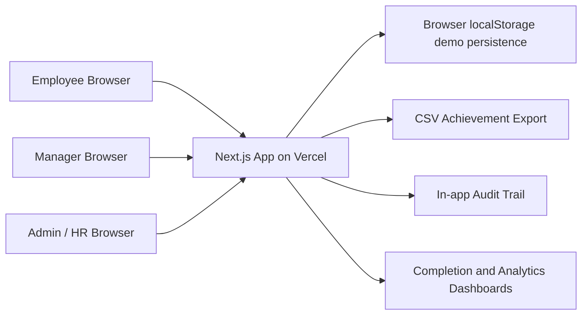
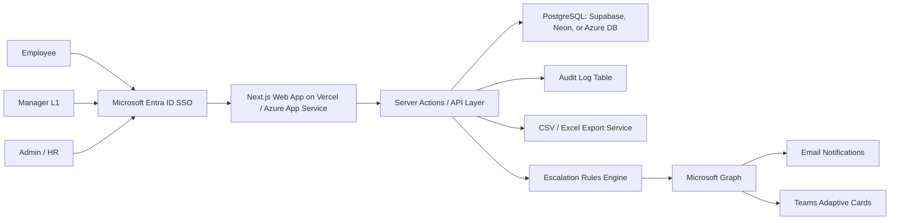

# Architecture

## Current Hackathon Demo Architecture

## Why This Architecture

- Fastest path to a stable hosted demo.
- No paid services required.
- No dependency on external credentials during the hackathon.
- Works as a browser-accessible portal, satisfying the primary submission constraint.
- Keeps the UI, validation rules, role flows, and governance logic visible to judges.

## Production Architecture Upgrade

## Core Modules

| Module | Responsibility |
| --- | --- |
| Role shell | Employee, Manager, and Admin persona-specific navigation |
| Goal sheet | Goal CRUD, validation, submission, lock state |
| Approval workflow | L1 review, inline target/weightage edits, approval, return for rework |
| Shared goals | Department KPI push and linked achievement sync |
| Quarterly updates | Employee actual achievement entry and progress score calculation |
| Check-ins | Manager planned vs actual review and structured comments |
| Admin governance | Cycle windows, hierarchy view, unlock exceptions |
| Reporting | Achievement report CSV export |
| Audit trail | Who changed what and when |
| Analytics | Completion, distribution, and escalation preview |

## Production Database Tables

- `users`
- `cycles`
- `goals`
- `goal_submissions`
- `shared_goals`
- `quarterly_updates`
- `check_ins`
- `audit_logs`
- `escalation_logs`

## Cost Optimization

- Vercel free tier or low-cost serverless hosting.
- Supabase/Neon free tier PostgreSQL for hackathon scale.
- Static-first UI and lightweight server actions.
- CSV export generated on demand instead of scheduled heavy reporting.
- Notification integrations can be event-driven and disabled for demo tenants.

