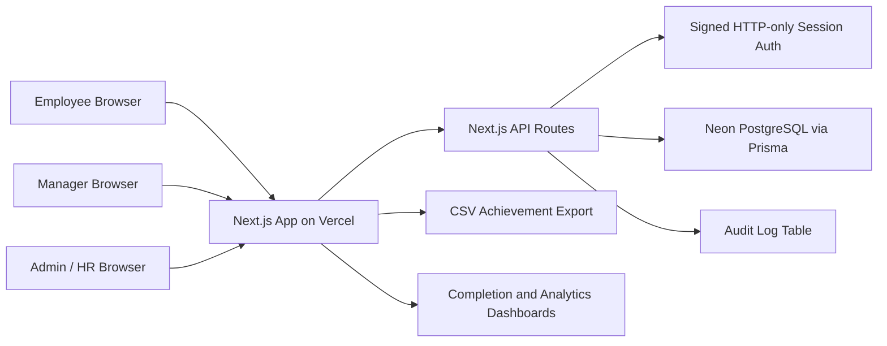
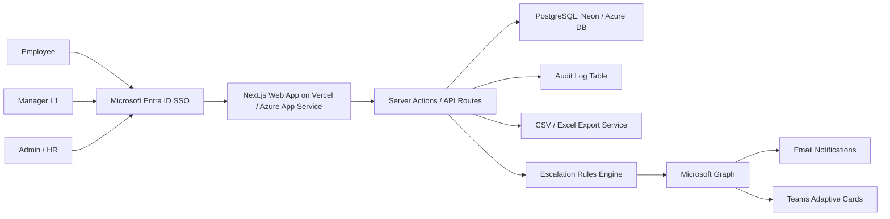

# Architecture

## Current Architecture

## Why This Architecture

- Hosted, browser-accessible, and cost-aware for hackathon judging.
- Uses Neon PostgreSQL so auth, goals, approvals, updates, check-ins, audit logs, and reports persist across sessions.
- Keeps role access scoped in the API: employees see their own data, managers see their team, and Admin/HR sees governance-wide data.
- Uses standard Vercel deployment with Prisma generation during install/build.
- Leaves Microsoft Entra and Teams integration as future enterprise modules unless tenant credentials are available.

## Environment

- `DATABASE_URL`: Neon PostgreSQL connection string.
- `SESSION_SECRET`: long random session-signing secret.
- `NEXTAUTH_SECRET`: optional compatible secret name.
- `NEXTAUTH_URL`: deployed Vercel URL.

## Production Architecture Upgrade

## Core Modules

| Module | Responsibility |
| --- | --- |
| Role shell | Employee, Manager, and Admin persona-specific navigation |
| Goal sheet | Goal CRUD, validation, submission, lock state |
| Approval workflow | L1 review, inline target/weightage edits, approval, return for rework |
| Shared goals | Department KPI push and linked achievement sync |
| Quarterly updates | Employee actual achievement entry and progress score calculation |
| Check-ins | Manager planned vs actual review and structured comments |
| Admin governance | Cycle windows, hierarchy view, unlock exceptions |
| Reporting | Achievement report CSV export |
| Audit trail | Who changed what and when |
| Analytics | Completion, distribution, and escalation preview |

## Production Database Tables

- `users`
- `cycles`
- `goals`
- `goal_submissions`
- `shared_goals`
- `quarterly_updates`
- `check_ins`
- `audit_logs`
- `escalation_logs`

## Cost Optimization

- Vercel free tier or low-cost serverless hosting.
- Supabase/Neon free tier PostgreSQL for hackathon scale.
- Static-first UI and lightweight server actions.
- CSV export generated on demand instead of scheduled heavy reporting.
- Notification integrations can be event-driven and disabled for demo tenants.
